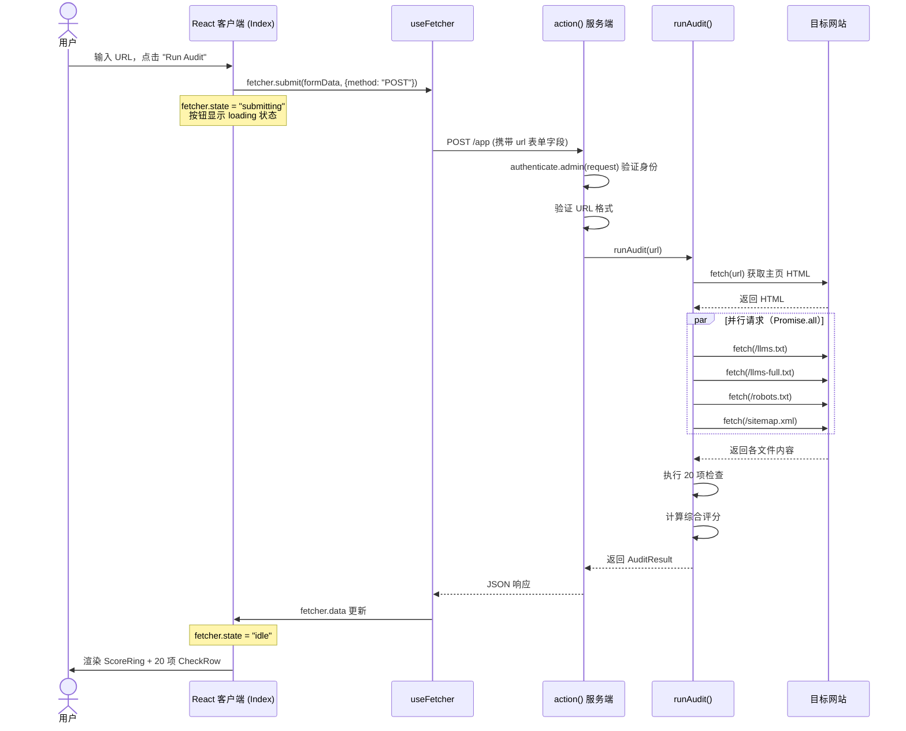
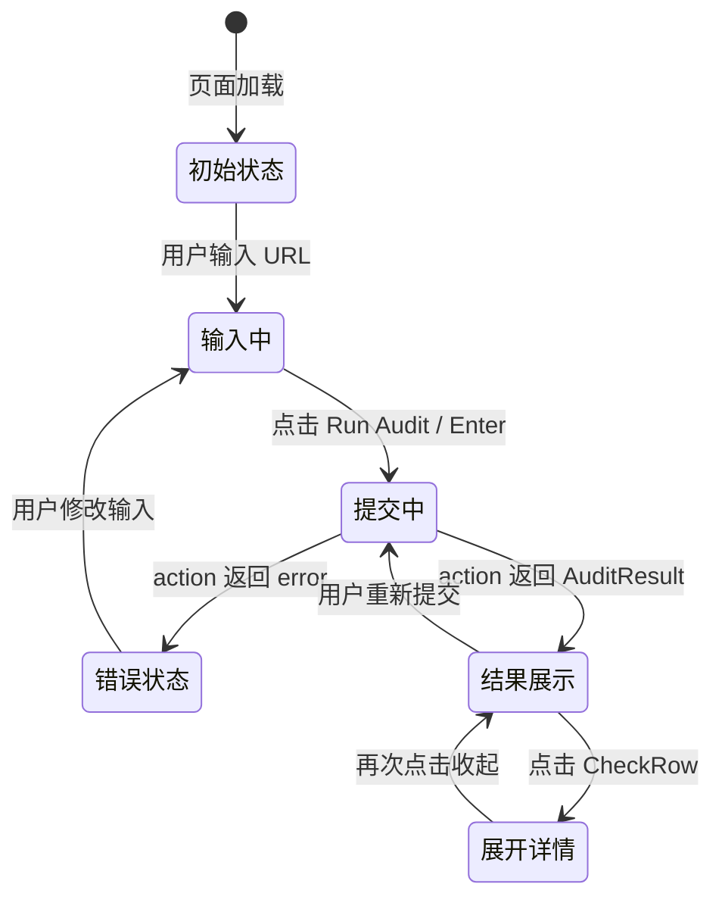
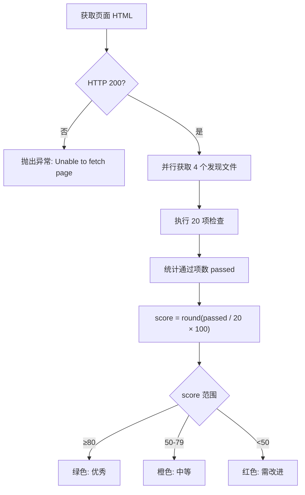

# GEO 审计功能技术架构文档

> 本文档基于 `app/routes/app._index.tsx` 的实际代码编写，全面阐述 GEO 审计功能的系统设计、代码架构和实现细节。

---

## 目录

1. [项目概述](#1-项目概述)
2. [技术栈](#2-技术栈)
3. [文件结构](#3-文件结构)
4. [代码架构详解](#4-代码架构详解)
5. [20 项检查详解](#5-20-项检查详解)
6. [UI 组件设计](#6-ui-组件设计)
7. [数据流程图](#7-数据流程图)
8. [如何扩展](#8-如何扩展)
9. [性能优化](#9-性能优化)
10. [最佳实践](#10-最佳实践)

---

## 1. 项目概述

### 1.1 功能介绍

GEO (Generative Engine Optimization，生成式引擎优化) 审计工具是集成于 Shopify App 内的自动化网站分析系统。它通过 20 项专业检查，全面评估任意网站对 AI 搜索引擎（如 ChatGPT、Claude、Perplexity、Google AI Overview）的优化程度，生成 0-100 分的 AEO 就绪度评分，并为每项问题提供具体的修复建议。

### 1.2 应用场景

| 使用场景 | 目标用户 | 价值 |
|----------|----------|------|
| 电商网站审计 | Shopify 商家 | 确保产品页被 AI 购物助手正确索引 |
| 内容营销优化 | 内容运营团队 | 提升文章在 AI 答案中的引用率 |
| 竞品分析 | SEO 分析师 | 对标竞争对手的 GEO 优化状态 |
| 技术合规检查 | 开发工程师 | 验证网站技术指标是否达标 |
| 上线前检查 | 产品经理 | 新页面发布前的标准化审计流程 |

### 1.3 核心价值

- **一键审计**: 输入 URL，30 秒内完成全量 20 项检查
- **分类可视化**: 按 5 个维度（发现性、结构、内容、技术、渲染）展示得分
- **可操作建议**: 每项检查不仅告知"是否通过"，更说明"为什么"和"如何修复"
- **AI 优先视角**: 专注于 AI 爬虫视角，而不是传统 SEO 指标

---

## 2. 技术栈

### 2.1 前端技术

| 技术 | 版本 | 用途 |
|------|------|------|
| React | 18.x | UI 框架，组件化开发 |
| TypeScript | 5.x | 类型安全，代码智能提示 |
| React Router | 7.x | 路由管理、数据加载 (`useFetcher`) |
| SVG | 原生 | 评分环形图渲染 |
| CSS-in-JS | 内联样式 | 组件样式，零依赖 |

### 2.2 后端技术

| 技术 | 用途 |
|------|------|
| Node.js | 服务端运行环境 |
| Fetch API | 并行 HTTP 请求（抓取目标页面） |
| 正则表达式 | HTML 结构解析和内容提取 |
| Shopify Auth | 会话鉴权，保护审计 API |

### 2.3 框架和工具

| 工具 | 用途 |
|------|------|
| Remix (React Router) | 全栈框架，提供服务端 `loader`/`action` 模式 |
| Shopify App React Router | Shopify 应用集成层 |
| Shopify Polaris Web Components | `<s-page>`, `<s-section>`, `<s-button>` 等 UI 原语 |

---

## 3. 文件结构

```
opti-geo/
├── app/
│   ├── routes/
│   │   └── app._index.tsx          # GEO 审计核心文件（本文档焦点）
│   │   └── app.tsx                 # 应用布局外壳
│   │   └── app.additional.tsx      # 附加页面路由
│   │   └── auth.$.tsx              # OAuth 授权路由
│   │   └── auth.login/             # 登录页
│   │   └── webhooks.*.tsx          # Shopify Webhook 处理
│   ├── shopify.server.ts           # Shopify 认证工厂函数
│   ├── db.server.ts                # Prisma 数据库客户端
│   ├── globals.d.ts                # 全局类型声明
│   └── root.tsx                    # 根组件
├── prisma/
│   └── schema.prisma               # 数据库模型
├── public/                         # 静态资源
├── shopify.app.toml                # Shopify 应用配置
└── package.json
```

### 3.1 核心文件职责

`app/routes/app._index.tsx` 是整个审计功能的单文件实现，包含以下部分：

| 代码区域 | 代码行 | 职责 |
|----------|--------|------|
| Types | 7–25 | TypeScript 类型定义 |
| Audit Helpers | 27–49 | HTML 处理工具函数 |
| `runAudit()` | 51–419 | 核心审计逻辑，20 项检查 |
| `loader` | 424–427 | 页面加载时的鉴权守卫 |
| `action` | 429–452 | 处理表单提交，触发审计 |
| `CATEGORY_META` | 456–462 | 分类元数据（颜色、图标、标签） |
| `ScoreRing` | 464–493 | 评分环 SVG 组件 |
| `CheckRow` | 495–531 | 可折叠检查项组件 |
| `Index` | 535–645 | 主页面组件 |
| `headers` | 647–649 | HTTP 响应头（Shopify boundary） |

---

## 4. 代码架构详解

### 4.1 类型定义

```typescript
// 5 个检查类别
type CheckCategory = "discovery" | "structure" | "content" | "technical" | "rendering";

// 单项检查结果
type Check = {
  id: string;          // 唯一标识符，如 "llms_txt"
  label: string;       // 显示名称，如 "llms.txt"
  category: CheckCategory; // 所属类别
  pass: boolean;       // 是否通过
  value: string;       // 当前值摘要，如 "Present" 或 "12 words"
  detail: string;      // 详细说明和优化建议
};

// 完整审计结果
type AuditResult = {
  url: string;         // 被审计的 URL
  score: number;       // 综合评分 0-100
  checks: Check[];     // 所有 20 项检查结果
  error?: string;      // 错误信息（可选）
};
```

**设计决策**: `value` 和 `detail` 分离设计允许 UI 以紧凑的摘要（value）呈现关键数据，同时将详细说明（detail）折叠在交互展开区域中，不增加视觉噪音。

### 4.2 工具函数

#### `stripHtml(html: string): string`

将原始 HTML 转换为纯文本，用于内容分析：

```typescript
function stripHtml(html: string) {
  return html
    .replace(/<script[\s\S]*?<\/script>/gi, " ")   // 移除 script 标签及内容
    .replace(/<style[\s\S]*?<\/style>/gi, " ")     // 移除 style 标签及内容
    .replace(/<[^>]+>/g, " ")                       // 移除所有 HTML 标签
    .replace(/\s+/g, " ")                           // 合并多余空白
    .trim();
}
```

**注意**: 正则表达式中的 `[\s\S]*?` 采用非贪婪匹配，防止跨标签错误匹配。

#### `tryFetch(url: string): Promise<{ok, text, status}>`

带错误处理的 HTTP 请求封装：

```typescript
async function tryFetch(url: string): Promise<{ ok: boolean; text: string; status: number }> {
  try {
    const res = await fetch(url, {
      headers: { "User-Agent": "GEO-AEO-Tracker/1.0" },  // 标识爬虫身份
      redirect: "follow",                                   // 自动跟随重定向
    });
    const text = res.ok ? await res.text() : "";
    return { ok: res.ok, text, status: res.status };
  } catch {
    return { ok: false, text: "", status: 0 };  // 网络错误时返回安全默认值
  }
}
```

**设计特点**: 捕获所有异常并返回统一结构，调用方无需处理 try/catch，使 `runAudit` 逻辑更清晰。

### 4.3 服务端逻辑

#### Loader（页面加载守卫）

```typescript
export const loader = async ({ request }: LoaderFunctionArgs) => {
  await authenticate.admin(request);  // 验证 Shopify 管理员身份
  return null;                         // 无需向客户端传递初始数据
};
```

**职责**: 确保只有已认证的 Shopify 商家可以访问审计功能，防止未授权的 API 使用。

#### Action（审计触发器）

```typescript
export const action = async ({ request }: ActionFunctionArgs) => {
  await authenticate.admin(request);  // 每次 POST 都重新验证身份

  const formData = await request.formData();
  const url = formData.get("url") as string;

  // 第一层验证：URL 是否存在
  if (!url) {
    return { error: "URL is required" };
  }

  // 第二层验证：URL 格式是否合法
  try {
    new URL(url);  // 使用 WHATWG URL API 验证
  } catch {
    return { error: "Invalid URL format" };
  }

  // 执行审计，包装异常
  try {
    const result = await runAudit(url);
    return result;
  } catch (error) {
    const message = error instanceof Error ? error.message : "Unknown error";
    return { error: message };
  }
};
```

**错误分层**: 区分输入验证错误（用户问题）和运行时错误（网络问题），便于前端展示不同的提示信息。

#### `runAudit(url: string): Promise<AuditResult>`

审计核心函数，执行流程：

```
1. 解析目标 URL
2. 串行获取主页 HTML（必须成功，否则抛出异常）
3. 并行获取 4 个发现性文件（llms.txt, llms-full.txt, robots.txt, sitemap.xml）
4. 依次执行 20 项检查，构建 Check[] 数组
5. 计算得分：通过项数 / 总项数 × 100
6. 返回 AuditResult
```

并行请求示例（第 62-67 行）：

```typescript
// 主页已获取，4 个发现文件并行抓取，节省 ~75% 等待时间
const [llmsRes, llmsFullRes, robotsRes, sitemapRes] = await Promise.all([
  tryFetch(`${target.origin}/llms.txt`),
  tryFetch(`${target.origin}/llms-full.txt`),
  tryFetch(`${target.origin}/robots.txt`),
  tryFetch(`${target.origin}/sitemap.xml`),
]);
```

### 4.4 客户端组件结构

```
Index (主页面)
├── URL 输入框 + "Run Audit" 按钮
├── 错误提示区（条件渲染）
└── 审计结果区（条件渲染）
    ├── ScoreRing (评分环)
    ├── AEO 就绪度摘要
    ├── 分类标签行 (5 个类别各一个 badge)
    └── 按类别分组的检查列表
        └── CheckRow × N (可折叠)
```

---

## 5. 20 项检查详解

### 类别一：Discovery（发现性）

> AI 爬虫能否找到并理解你的网站？共 4 项。

---

#### 检查 1: llms.txt

| 属性 | 内容 |
|------|------|
| **ID** | `llms_txt` |
| **检查内容** | 网站根域名下是否存在 `/llms.txt` 文件 |
| **通过标准** | HTTP 请求返回 200 状态码 |
| **实现原理** | `tryFetch(`${target.origin}/llms.txt`)` 并检查 `res.ok` |

**优化建议**: 在网站根目录创建 `llms.txt` 文件，格式参考 [llmstxt.org](https://llmstxt.org)：

```text
# My Company

> Brief description of what we do

## Documentation

- [API Docs](https://example.com/docs): Full API reference
- [Getting Started](https://example.com/start): Quick start guide
```

---

#### 检查 2: llms-full.txt

| 属性 | 内容 |
|------|------|
| **ID** | `llms_full_txt` |
| **检查内容** | 网站根域名下是否存在 `/llms-full.txt` 文件 |
| **通过标准** | HTTP 请求返回 200 状态码 |
| **实现原理** | `tryFetch(`${target.origin}/llms-full.txt`)` 并检查 `res.ok` |

**优化建议**: `llms-full.txt` 是 `llms.txt` 的扩展版本，包含完整的内容转储，供 AI 模型深度读取。适合内容量较大的网站。

---

#### 检查 3: AI Bot Access (robots.txt)

| 属性 | 内容 |
|------|------|
| **ID** | `robots_ai_access` |
| **检查内容** | `robots.txt` 是否允许主流 AI 爬虫访问 |
| **通过标准** | `robots.txt` 存在，且被屏蔽的 AI 机器人 ≤ 2 个 |
| **监测的 AI 机器人** | gptbot, chatgpt-user, claudebot, anthropic-ai, google-extended, googleother, cohere-ai, bytespider, perplexitybot, ccbot（共 10 个）|

**实现原理**:

```typescript
const aiBots = ["gptbot", "chatgpt-user", "claudebot", ...];
for (const bot of aiBots) {
  // 检测 "User-agent: gptbot" 后跟 "Disallow: /" 的模式
  const botPattern = new RegExp(
    `user-agent:\\s*${bot}[\\s\\S]*?disallow:\\s*/`, "i"
  );
  if (botPattern.test(robotsRes.text)) {
    blockedBots.push(bot);
  }
}
```

**优化建议**: 确保 `robots.txt` 不包含以下屏蔽规则：

```text
# 不应该有这些（屏蔽 AI 爬虫）
User-agent: GPTBot
Disallow: /

# 应该保持允许（或完全不提及）
User-agent: GPTBot
Allow: /
```

---

#### 检查 4: XML Sitemap

| 属性 | 内容 |
|------|------|
| **ID** | `sitemap` |
| **检查内容** | 网站是否有包含有效 URL 的 `sitemap.xml` |
| **通过标准** | `/sitemap.xml` 可访问，且包含至少一个 `<url>` 标签 |
| **实现原理** | 检测 `<url>` 标签数量：`(sitemapRes.text.match(/<url>/gi) ?? []).length` |

**优化建议**: Sitemap 帮助 AI 系统发现所有页面，而不仅仅是首页。Shopify 自动生成 sitemap，确保不被屏蔽即可。

---

### 类别二：Structure & Schema（结构与结构化数据）

> 页面是否提供了机器可读的结构化信息？共 5 项。

---

#### 检查 5: JSON-LD Structured Data

| 属性 | 内容 |
|------|------|
| **ID** | `json_ld` |
| **检查内容** | 页面是否包含 JSON-LD 格式的结构化数据 |
| **通过标准** | 至少发现一个 `<script type="application/ld+json">` 块 |

**实现原理**:

```typescript
// 匹配所有 JSON-LD 脚本块
const jsonLdBlocks = html.match(
  /<script[^>]*type\s*=\s*["']application\/ld\+json["'][^>]*>([\s\S]*?)<\/script>/gi
) ?? [];

// 提取所有 Schema @type
for (const block of jsonLdBlocks) {
  const parsed = JSON.parse(inner);
  const items = Array.isArray(parsed) ? parsed : [parsed];
  for (const item of items) {
    if (item?.["@type"]) {
      schemaTypes.push(...[item["@type"]].flat());
    }
  }
}
```

**优化建议**: 添加适合你业务的 Schema 类型：

```html
<script type="application/ld+json">
{
  "@context": "https://schema.org",
  "@type": "Product",
  "name": "产品名称",
  "description": "产品描述",
  "offers": {
    "@type": "Offer",
    "price": "99.99",
    "priceCurrency": "USD"
  }
}
</script>
```

---

#### 检查 6: FAQ / Q&A Schema

| 属性 | 内容 |
|------|------|
| **ID** | `faq_schema` |
| **检查内容** | 是否存在 FAQPage Schema 或 FAQ 结构的 HTML |
| **通过标准** | JSON-LD 中有 `FAQPage` 类型，或 HTML 中含 `<details>`/`<summary>`/class="faq" |

**实现原理**:

```typescript
const hasFaqSchema = schemaTypes.some((t) => /faq/i.test(t));
const hasFaqHtml = /<details|<summary|class="faq"|id="faq"|class="accordion"/i.test(html);
const pass = hasFaqSchema || hasFaqHtml;
```

**优化建议**: FAQ Schema 是 AI 答案引用率最高的 Schema 类型之一：

```html
<script type="application/ld+json">
{
  "@context": "https://schema.org",
  "@type": "FAQPage",
  "mainEntity": [{
    "@type": "Question",
    "name": "常见问题一？",
    "acceptedAnswer": {
      "@type": "Answer",
      "text": "详细回答..."
    }
  }]
}
</script>
```

---

#### 检查 7: Open Graph Tags

| 属性 | 内容 |
|------|------|
| **ID** | `open_graph` |
| **检查内容** | 是否同时存在 og:title、og:description、og:image |
| **通过标准** | 三者同时存在（AND 逻辑） |

**实现原理**:

```typescript
const ogTitle = /og:title/i.test(html);
const ogDesc  = /og:description/i.test(html);
const ogImage = /og:image/i.test(html);
const ogComplete = ogTitle && ogDesc && ogImage;
```

**优化建议**: 完整的 OG 标签：

```html
<meta property="og:title" content="页面标题" />
<meta property="og:description" content="页面描述（150字以内）" />
<meta property="og:image" content="https://example.com/og-image.jpg" />
<meta property="og:url" content="https://example.com/page" />
```

---

#### 检查 8: Meta Description

| 属性 | 内容 |
|------|------|
| **ID** | `meta_description` |
| **检查内容** | Meta description 是否存在且长度适当 |
| **通过标准** | 长度在 50–300 字符之间 |

**实现原理**:

```typescript
const metaDescMatch = html.match(
  /<meta[^>]*name=["']description["'][^>]*content=["']([^"']*)["']/i
);
const metaDesc = metaDescMatch?.[1] ?? "";
const metaDescOk = metaDesc.length >= 50 && metaDesc.length <= 300;
```

**优化建议**: 优质 Meta Description 示例：
- 太短（< 50 字符）: "我们卖衣服。" — AI 无法充分理解页面主题
- 合适（50-160 字符）: "探索我们的春季女装系列，精选 500+ 款式，提供免费配送和 30 天退换。" — 清晰且信息丰富
- 太长（> 300 字符）: 搜索引擎会截断，AI 处理效率降低

---

#### 检查 9: Canonical Tag

| 属性 | 内容 |
|------|------|
| **ID** | `canonical` |
| **检查内容** | 页面是否有 canonical 标签 |
| **通过标准** | HTML 中存在 `<link rel="canonical" ...>` |

**实现原理**:

```typescript
const hasCanonical = /<link[^>]*rel=["']canonical["']/i.test(html);
```

**优化建议**:

```html
<link rel="canonical" href="https://example.com/canonical-page" />
```

Canonical 标签告诉 AI 系统哪个 URL 是权威版本，避免重复内容问题。

---

### 类别三：Content Quality（内容质量）

> 内容是否符合 AI 模型偏好的结构和深度？共 4 项。

---

#### 检查 10: BLUF / Direct-Answer Style

| 属性 | 内容 |
|------|------|
| **ID** | `bluf_style` |
| **检查内容** | 内容是否采用"先说结论"（BLUF: Bottom Line Up Front）风格 |
| **通过标准** | BLUF 评分 ≥ 50% |

**实现原理**:

```typescript
const firstChunk = plain.slice(0, Math.floor(plain.length * 0.2));
const bulletCount = (html.match(/<li\b/gi) ?? []).length;

// 检测直接回答关键词
const hasDirectAnswer = /\b(in short|tl;dr|summary|key takeaways|bottom line|
  the answer is|here('?s| is) (what|how|why))\b/i.test(firstChunk);

// 综合评分：直接回答词 + 列表项 + 内容长度
const blufScore = Math.min(1,
  (Number(hasDirectAnswer) + Number(bulletCount > 3) + Number(firstChunk.length > 100)) / 2
);
```

**优化建议**: BLUF 写作模式示例：

```
❌ 传统写作（AI 不友好）:
"我们公司成立于2010年，经过多年发展，我们推出了..."

✅ BLUF 写作（AI 友好）:
"简而言之：我们提供XXX服务，解决YYY问题。以下是详细介绍..."
```

---

#### 检查 11: Heading Hierarchy

| 属性 | 内容 |
|------|------|
| **ID** | `heading_hierarchy` |
| **检查内容** | 标题结构是否规范 |
| **通过标准** | 恰好 1 个 H1，至少 2 个 H2 |

**实现原理**:

```typescript
const h1Count = (html.match(/<h1[\s>]/gi) ?? []).length;
const h2Count = (html.match(/<h2[\s>]/gi) ?? []).length;
const h3Count = (html.match(/<h3[\s>]/gi) ?? []).length;
const headingOk = h1Count === 1 && h2Count >= 2;
```

**优化建议**: 规范的标题层级：

```html
<h1>页面主题（唯一）</h1>        <!-- AI 识别为主要话题 -->
  <h2>子主题一</h2>              <!-- AI 识别为主要章节 -->
    <h3>具体细节</h3>
  <h2>子主题二</h2>
    <h3>具体细节</h3>
```

---

#### 检查 12: Content Depth

| 属性 | 内容 |
|------|------|
| **ID** | `content_length` |
| **检查内容** | 页面纯文本内容的词数 |
| **通过标准** | 词数 ≥ 300 |

**实现原理**:

```typescript
const wordCount = plain.split(/\s+/).filter(Boolean).length;
const contentLengthOk = wordCount >= 300;
```

**评分层级**:

- `< 300 词`: 内容过薄，AI 倾向于引用内容更丰富的竞品
- `300-2000 词`: 适合 AI 提取答案
- `> 2000 词`: 全面深度内容，最适合 AI 引用

---

#### 检查 13: Internal Links

| 属性 | 内容 |
|------|------|
| **ID** | `internal_links` |
| **检查内容** | 页面包含的内链数量 |
| **通过标准** | 内链数量 ≥ 3 |

**实现原理**:

```typescript
// 匹配指向同域名的链接（包括相对路径和绝对路径）
const internalLinkPattern = new RegExp(
  `<a[^>]*href=["'](?:https?://(?:www\\.)?${target.hostname.replace(/\./g, "\\.")})?/[^"']*["']`, "gi"
);
const internalLinks = (html.match(internalLinkPattern) ?? []).length;
```

**优化建议**: 良好的内链建设帮助 AI 理解网站整体内容地图，提升相关页面的综合权威性。

---

### 类别四：Technical（技术指标）

> 页面是否满足基础技术要求？共 3 项。

---

#### 检查 14: HTTPS

| 属性 | 内容 |
|------|------|
| **ID** | `https` |
| **检查内容** | 网站是否使用 HTTPS 协议 |
| **通过标准** | URL 协议为 `https:` |

**实现原理**:

```typescript
const isHttps = target.protocol === "https:";
```

HTTPS 是 AI 引用来源时的基础信任要求。HTTP 站点会被主流 AI 系统降低可信度评分。

---

#### 检查 15: Page Size

| 属性 | 内容 |
|------|------|
| **ID** | `page_size` |
| **检查内容** | 页面 HTML 文件大小 |
| **通过标准** | 页面大小 < 500 KB |

**实现原理**:

```typescript
const pageSizeKb = Math.round(html.length / 1024);
const pageSizeOk = pageSizeKb < 500;
```

**优化建议**: 过大的页面（>500KB）会导致 AI 爬虫超时或跳过。常见原因：内联 Base64 图片、未压缩的 JSON 数据、过多内联样式。

---

#### 检查 16: Language Attribute

| 属性 | 内容 |
|------|------|
| **ID** | `lang_tag` |
| **检查内容** | `<html>` 标签是否包含 `lang` 属性 |
| **通过标准** | 检测到 `<html lang="...">` |

**实现原理**:

```typescript
const langMatch = html.match(/<html[^>]*lang=["']([^"']+)["']/i);
const hasLang = !!langMatch;
```

**优化建议**:

```html
<html lang="zh-CN">   <!-- 中文简体 -->
<html lang="en">      <!-- 英文 -->
<html lang="en-US">   <!-- 美式英语 -->
```

---

### 类别五：Server-Side Rendering（服务端渲染）

> AI 爬虫是否能直接读取页面内容（不需要执行 JavaScript）？共 4 项。

---

#### 检查 17: Client-Side Rendering Detection

| 属性 | 内容 |
|------|------|
| **ID** | `csr_detection` |
| **检查内容** | 页面是否依赖纯客户端渲染（CSR）|
| **通过标准** | 未检测到纯 CSR 信号，或有 SSR 特征标记 |

**实现原理**:

```typescript
// 检测 CSR 框架的空容器标志
const csrFrameworkSignals = [
  { name: "React CSR",  pattern: /<div\s+id=["'](root|app|__next)["'][^>]*>\s*<\/div>/i },
  { name: "Vue CSR",    pattern: /<div\s+id=["'](app|__vue_app__)["'][^>]*>\s*<\/div>/i },
  { name: "Angular",    pattern: /<app-root[^>]*>\s*<\/app-root>/i },
  { name: "Svelte",     pattern: /<div\s+id=["']svelte["'][^>]*>\s*<\/div>/i },
];

// 判断是否为"空壳" CSR
const textToHtmlRatio = plain.length / Math.max(html.length, 1);
const hasMinimalContent = plain.length < 200 && html.length > 2000;
const likelyCsr = detectedCsrFrameworks.length > 0 && (hasMinimalContent || textToHtmlRatio < 0.02);

// 检测 SSR 特征（即使用了框架，也做了服务端渲染）
const hasNextData = /__NEXT_DATA__/i.test(html);    // Next.js SSR 数据
const hasReactRoot = /data-reactroot/i.test(html);  // React SSR 标记
const hasSsrMarkers = hasNextData || hasReactRoot;

// 只有纯 CSR（无 SSR 标记）才判定为失败
const csrCheckPass = !likelyCsr || hasSsrMarkers;
```

**判断逻辑矩阵**:

| CSR 框架 | SSR 标记 | 文本比率 | 判定 |
|----------|----------|----------|------|
| 无 | 任意 | 任意 | 通过（服务端渲染）|
| 有 | 有 | 任意 | 通过（框架+SSR）|
| 有 | 无 | > 2% | 通过（CSR 但内容充足）|
| 有 | 无 | < 2% | **失败**（纯 CSR 空壳）|

---

#### 检查 18: Noscript Fallback

| 属性 | 内容 |
|------|------|
| **ID** | `noscript_fallback` |
| **检查内容** | 是否有含实质内容的 `<noscript>` 标签 |
| **通过标准** | `<noscript>` 存在且内含文本超过 20 个字符 |

**实现原理**:

```typescript
const hasNoscript = /<noscript[\s>]/i.test(html);
const noscriptContent = html.match(/<noscript[^>]*>([\s\S]*?)<\/noscript>/i)?.[1] ?? "";
const noscriptHasContent = stripHtml(noscriptContent).length > 20;
const pass = hasNoscript && noscriptHasContent;
```

**优化建议**:

```html
<noscript>
  <p>本页面需要 JavaScript 运行。请启用 JavaScript 或访问我们的
  <a href="/no-js-version">无 JavaScript 版本</a>。</p>
</noscript>
```

---

#### 检查 19: JavaScript Weight

| 属性 | 内容 |
|------|------|
| **ID** | `js_bundle_weight` |
| **检查内容** | 外部 JS 文件数量和内联 JS 总大小 |
| **通过标准** | 外部 JS ≤ 15 个，且内联 JS < 100KB |

**实现原理**:

```typescript
const scriptTags    = html.match(/<script[^>]*src=["'][^"']+["'][^>]*>/gi) ?? [];
const inlineScripts = html.match(/<script(?![^>]*src=)[\s\S]*?<\/script>/gi) ?? [];
const totalInlineScriptSize = inlineScripts.reduce((sum, s) => sum + s.length, 0);
const externalScriptCount = scriptTags.length;
const jsHeavy = externalScriptCount > 15 || totalInlineScriptSize > 100_000;
```

**优化建议**: JS 过重影响 AI 爬虫的内容提取效率：
- 使用代码分割（code splitting）减少初始包体积
- 将关键内容移至服务端渲染，不依赖 JS 加载
- 使用 `defer`/`async` 属性，避免阻塞 HTML 解析

---

#### 检查 20: Server-Rendered Content Quality

| 属性 | 内容 |
|------|------|
| **ID** | `server_content_quality` |
| **检查内容** | 服务端返回的 HTML 是否包含足量的语义化内容 |
| **通过标准** | 纯文本长度 > 500 字符，且含有 `<article>`/`<main>`/`<section>` 语义标签（或无测试 data 属性）|

**实现原理**:

```typescript
const serverContentLen = plain.length;
const hasSemanticHtml   = /<(article|main|section)[\s>]/i.test(html);
const hasDataAttributes = /data-(testid|cy|component)/i.test(html);
// 内容充足 + 语义结构，或内容充足但无测试属性（后者说明不是纯测试页）
const serverContentOk = serverContentLen > 500 && (hasSemanticHtml || !hasDataAttributes);
```

**优化建议**: 使用语义化 HTML 结构：

```html
<main>
  <article>
    <h1>文章标题</h1>
    <section>
      <h2>章节一</h2>
      <p>内容...</p>
    </section>
  </article>
</main>
```

---

### 评分计算

```typescript
const passed = checks.filter((c) => c.pass).length;
const score  = Math.round((passed / checks.length) * 100);
// 例：通过 15 项 → score = Math.round(15/20 * 100) = 75
```

**评分含义**:

| 分值范围 | 颜色 | 含义 |
|----------|------|------|
| 80–100 | 绿色 `#10b981` | 优秀，AI 友好 |
| 50–79 | 橙色 `#f59e0b` | 中等，有改进空间 |
| 0–49 | 红色 `#ef4444` | 较差，需要重点优化 |

---

## 6. UI 组件设计

### 6.1 ScoreRing（评分环组件）

SVG 圆形进度条，使用 `strokeDasharray` 和 `strokeDashoffset` 实现填充效果。

```typescript
function ScoreRing({ score }: { score: number }) {
  const r    = 40;                          // 圆半径（px）
  const circ = 2 * Math.PI * r;             // 周长 ≈ 251.3
  const offset = circ * (1 - score / 100);  // 未填充部分的偏移量
  const color  = score >= 80 ? "#10b981" : score >= 50 ? "#f59e0b" : "#ef4444";

  return (
    <div style={{ position: "relative", width: 110, height: 110 }}>
      <svg width="110" height="110" viewBox="0 0 110 110">
        {/* 背景圆（灰色，完整） */}
        <circle cx="55" cy="55" r={r} fill="none" stroke="#e5e7eb" strokeWidth="8" />
        {/* 前景圆（有色，按分值填充）*/}
        <circle
          cx="55" cy="55" r={r}
          fill="none"
          stroke={color}
          strokeWidth="8"
          strokeLinecap="round"
          strokeDasharray={circ}      // 总周长
          strokeDashoffset={offset}   // 从起点偏移，实现"缺口"效果
          transform="rotate(-90 55 55)" // 从顶部 12 点方向开始绘制
          style={{ transition: "stroke-dashoffset 0.6s ease" }} // 平滑动画
        />
      </svg>
      {/* 中心数字 */}
      <span style={{ position: "absolute", fontSize: "1.5rem", fontWeight: "bold", color }}>
        {score}
      </span>
    </div>
  );
}
```

**SVG 圆形进度条原理示意**:

```
strokeDasharray  = 总周长 (251.3)
strokeDashoffset = 251.3 × (1 - score/100)

score = 75:
  offset = 251.3 × 0.25 = 62.8
  → 显示 75% 的圆弧，空缺 25%
```

### 6.2 CheckRow（可折叠检查项）

```typescript
function CheckRow({ check }: { check: Check }) {
  const [open, setOpen] = useState(false);  // 本地折叠状态

  return (
    <div style={{ borderRadius: 8, border: "1px solid #e5e7eb", backgroundColor: "#fff" }}>
      <button onClick={() => setOpen(!open)} style={{ display: "flex", width: "100%", ... }}>
        {/* 通过/失败图标 */}
        <span style={{ color: check.pass ? "#10b981" : "#ef4444" }}>
          {check.pass ? "✓" : "✗"}
        </span>
        {/* 检查项名称 */}
        <span style={{ flex: 1, fontWeight: 500 }}>{check.label}</span>
        {/* 当前值摘要 Badge */}
        <span style={{ borderRadius: 6, backgroundColor: "#f3f4f6", padding: "2px 8px" }}>
          {check.value}
        </span>
        {/* 折叠箭头 */}
        <span>{open ? "▲" : "▼"}</span>
      </button>

      {/* 折叠内容：详细说明和优化建议 */}
      {open && (
        <div style={{ borderTop: "1px solid #e5e7eb", padding: "10px 16px", color: "#6b7280" }}>
          {check.detail}
        </div>
      )}
    </div>
  );
}
```

**交互设计说明**:
- 默认折叠所有检查项，减少视觉噪音
- 点击行内任意位置切换展开/收起
- 展开时显示 `detail` 字段（包含原因和修复建议）

### 6.3 主页面布局

分类元数据定义：

```typescript
const CATEGORY_META: Record<CheckCategory, { label: string; icon: string; color: string }> = {
  discovery: { label: "Discovery",             icon: "🔍", color: "#3b82f6" },
  structure: { label: "Structure & Schema",    icon: "🏗️", color: "#8b5cf6" },
  content:   { label: "Content Quality",       icon: "📝", color: "#10b981" },
  technical: { label: "Technical",             icon: "⚙️", color: "#f59e0b" },
  rendering: { label: "Server-Side Rendering", icon: "🖥️", color: "#ec4899" },
};
```

主页面结构（伪代码）：

```
<s-page heading="GEO Audit">
  <s-section>

    [输入区]
    ├── <input type="text" placeholder="https://example.com" />
    └── <s-button>Run Audit</s-button>

    [错误区] (条件渲染，result.error 存在时)
    └── <div style="background:#fef2f2"> {error message} </div>

    [结果区] (条件渲染，result 存在且无 error)
    ├── [评分卡片]
    │   ├── <ScoreRing score={result.score} />
    │   ├── "AEO Readiness Score" 标题
    │   ├── "X of 20 checks passed for {url}"
    │   └── [分类徽章行] Discovery X/4 | Structure X/5 | ...
    │
    └── [检查列表] (按类别分组)
        ├── [Discovery 组]
        │   ├── 标题: "🔍 Discovery"
        │   ├── <CheckRow check={llms_txt} />
        │   ├── <CheckRow check={llms_full_txt} />
        │   ├── <CheckRow check={robots_ai_access} />
        │   └── <CheckRow check={sitemap} />
        ├── [Structure & Schema 组]
        │   └── ... (5 项)
        ├── [Content Quality 组]
        │   └── ... (4 项)
        ├── [Technical 组]
        │   └── ... (3 项)
        └── [Server-Side Rendering 组]
            └── ... (4 项)

  </s-section>
</s-page>
```

---

## 7. 数据流程图

### 7.1 完整数据流



### 7.2 组件状态流



### 7.3 评分计算流



---

## 8. 如何扩展

### 8.1 添加新的检查项

在 `runAudit()` 函数中，仿照现有检查模式添加新检查。以添加"Twitter Card 检查"为例：

**第一步**: 定义检查逻辑：

```typescript
// 在 runAudit() 函数内，现有检查之后追加

// 21. Twitter Card Tags
const hasTwitterCard = /name=["']twitter:card["']/i.test(html);
const hasTwitterTitle = /name=["']twitter:title["']/i.test(html);
const twitterCardOk = hasTwitterCard && hasTwitterTitle;
checks.push({
  id: "twitter_card",
  label: "Twitter Card Tags",
  category: "structure",                   // 选择合适的类别
  pass: twitterCardOk,
  value: twitterCardOk ? "Complete" : "Incomplete",
  detail: twitterCardOk
    ? "Twitter Card tags found — content will render correctly when shared on X/Twitter."
    : "Missing twitter:card or twitter:title. Add meta tags for better social sharing.",
});
```

**第二步**: 如需新类别，扩展类型定义：

```typescript
// 修改 CheckCategory 类型
type CheckCategory = "discovery" | "structure" | "content" | "technical" | "rendering" | "social";

// 在 CATEGORY_META 中添加元数据
const CATEGORY_META = {
  // ...现有类别
  social: { label: "Social Sharing", icon: "📢", color: "#06b6d4" },
};
```

**注意**: 检查项数量会自动影响评分（分母变为 21），无需手动修改评分计算逻辑。

### 8.2 修改评分逻辑

当前评分为等权重（每项 1 票）。如需加权评分：

```typescript
// 为每个 Check 增加权重字段
type Check = {
  // ...现有字段
  weight: number; // 新增权重
};

// 修改评分计算
const totalWeight = checks.reduce((sum, c) => sum + c.weight, 0);
const passedWeight = checks.filter((c) => c.pass).reduce((sum, c) => sum + c.weight, 0);
const score = Math.round((passedWeight / totalWeight) * 100);

// 使用示例：给高优先级检查更高权重
checks.push({
  id: "llms_txt",
  weight: 2,    // llms.txt 权重加倍
  // ...
});
```

### 8.3 自定义 UI 样式

替换评分颜色阈值（修改 `ScoreRing` 组件）：

```typescript
// 当前：80/50 阈值
const color = score >= 80 ? "#10b981" : score >= 50 ? "#f59e0b" : "#ef4444";

// 自定义：90/70 更严格阈值
const color = score >= 90 ? "#10b981" : score >= 70 ? "#f59e0b" : "#ef4444";
```

使用 Shopify Polaris 设计 Token 替代硬编码颜色：

```typescript
// 替换硬编码颜色为 CSS 变量
const color = score >= 80
  ? "var(--p-color-text-success)"
  : score >= 50
  ? "var(--p-color-text-caution)"
  : "var(--p-color-text-critical)";
```

---

## 9. 性能优化

### 9.1 并行请求（已实现）

```typescript
// 4 个发现文件并行获取，而不是串行
// 串行耗时: T(llms) + T(llms-full) + T(robots) + T(sitemap)  ~= 4 × 300ms = 1200ms
// 并行耗时: max(T(llms), T(llms-full), T(robots), T(sitemap)) ~= 300ms

const [llmsRes, llmsFullRes, robotsRes, sitemapRes] = await Promise.all([
  tryFetch(`${target.origin}/llms.txt`),
  tryFetch(`${target.origin}/llms-full.txt`),
  tryFetch(`${target.origin}/robots.txt`),
  tryFetch(`${target.origin}/sitemap.xml`),
]);
```

### 9.2 错误处理（已实现）

```typescript
// tryFetch 封装：网络错误不中断审计流程
async function tryFetch(url): Promise<{ok, text, status}> {
  try {
    // ...
  } catch {
    return { ok: false, text: "", status: 0 };  // 安全降级
  }
}

// 主页获取失败则快速失败（无意义继续后续检查）
if (!pageRes.ok) {
  throw new Error(`Unable to fetch page (${pageRes.status})`);
}
```

### 9.3 超时控制（可扩展）

当前实现依赖 Fetch 的默认超时。建议为生产环境添加显式超时：

```typescript
async function tryFetchWithTimeout(
  url: string,
  timeoutMs = 8000
): Promise<{ ok: boolean; text: string; status: number }> {
  const controller = new AbortController();
  const timer = setTimeout(() => controller.abort(), timeoutMs);

  try {
    const res = await fetch(url, {
      headers: { "User-Agent": "GEO-AEO-Tracker/1.0" },
      redirect: "follow",
      signal: controller.signal,    // 传入 AbortSignal
    });
    clearTimeout(timer);
    const text = res.ok ? await res.text() : "";
    return { ok: res.ok, text, status: res.status };
  } catch (err) {
    clearTimeout(timer);
    const timedOut = err instanceof Error && err.name === "AbortError";
    return { ok: false, text: "", status: timedOut ? 408 : 0 };
  }
}
```

### 9.4 客户端性能

- `useFetcher` 相比 `useActionData` 的优势：不会触发整页重新渲染，只更新 `fetcher.data`
- `CheckRow` 的 `useState` 是局部状态，展开/折叠不影响其他组件重渲染
- `ScoreRing` 使用 CSS transition 动画（`stroke-dashoffset 0.6s ease`），依赖 GPU 加速

---

## 10. 最佳实践

### 10.1 代码组织

**单文件原则**: 当前实现将类型、服务端逻辑和客户端组件集中在一个文件中。这对于当前规模的功能是合适的。当功能增长时，建议按以下方式拆分：

```
app/routes/app._index.tsx       # 仅保留 loader、action、Index 组件
app/lib/audit/runAudit.ts       # 核心审计函数
app/lib/audit/types.ts          # 类型定义
app/lib/audit/checks/           # 每类检查拆分为独立文件
    discovery.ts
    structure.ts
    content.ts
    technical.ts
    rendering.ts
app/components/ScoreRing.tsx    # 可复用 UI 组件
app/components/CheckRow.tsx
```

### 10.2 类型安全

当前代码中的最佳实践：

```typescript
// 1. useFetcher 泛型：确保 data 类型正确推断
const fetcher = useFetcher<typeof action>();

// 2. 可选链运算符：安全访问可能为 undefined 的值
const metaDescMatch = html.match(...);
const metaDesc = metaDescMatch?.[1] ?? "";   // ?. 可选链 + ?? 空值合并

// 3. 类型断言最小化：仅在必要时使用 as
const url = formData.get("url") as string;   // formData.get 返回 FormDataEntryValue

// 4. 非空断言操作符：仅在已确认非 null 时使用
const lang = langMatch![1];   // 仅在 !!langMatch 为 true 后使用
```

### 10.3 错误处理

**分层错误处理策略**:

```typescript
// 层级 1：输入验证（同步，立即返回）
if (!url) return { error: "URL is required" };
try { new URL(url); } catch { return { error: "Invalid URL format" }; }

// 层级 2：网络层（tryFetch 静默处理，返回 {ok: false}）
// 设计意图：单个资源失败不影响整体审计

// 层级 3：页面不可访问（快速失败）
if (!pageRes.ok) throw new Error(`Unable to fetch page (${pageRes.status})`);

// 层级 4：顶层捕获（action 函数）
try {
  const result = await runAudit(url);
  return result;
} catch (error) {
  const message = error instanceof Error ? error.message : "Unknown error";
  return { error: message };
}
```

**前端错误展示**:

```typescript
// 类型安全的条件渲染
{result?.error && (
  <div style={{ backgroundColor: "#fef2f2", border: "1px solid #fecaca", color: "#991b1b" }}>
    {result.error}
  </div>
)}

{result && !result.error && (
  // 正常结果渲染...
)}
```

---

## 附录：检查项速查表

| # | ID | 类别 | 检查内容 | 通过标准 |
|---|-----|------|----------|----------|
| 1 | `llms_txt` | discovery | llms.txt 文件 | 文件存在（HTTP 200）|
| 2 | `llms_full_txt` | discovery | llms-full.txt 文件 | 文件存在（HTTP 200）|
| 3 | `robots_ai_access` | discovery | AI 机器人访问权限 | 被屏蔽 AI 机器人 ≤ 2 个 |
| 4 | `sitemap` | discovery | XML Sitemap | 存在且含有效 URL |
| 5 | `json_ld` | structure | JSON-LD 结构化数据 | 至少 1 个 LD+JSON 块 |
| 6 | `faq_schema` | structure | FAQ Schema | FAQPage schema 或 FAQ HTML |
| 7 | `open_graph` | structure | Open Graph 标签 | title + description + image 齐全 |
| 8 | `meta_description` | structure | Meta Description | 50–300 字符 |
| 9 | `canonical` | structure | Canonical 标签 | 存在 rel="canonical" |
| 10 | `bluf_style` | content | BLUF 直答风格 | 内容评分 ≥ 50% |
| 11 | `heading_hierarchy` | content | 标题层级 | 1 个 H1 + ≥2 个 H2 |
| 12 | `content_length` | content | 内容深度 | ≥ 300 词 |
| 13 | `internal_links` | content | 内部链接 | ≥ 3 个内链 |
| 14 | `https` | technical | HTTPS 协议 | URL 使用 https: |
| 15 | `page_size` | technical | 页面大小 | < 500 KB |
| 16 | `lang_tag` | technical | 语言属性 | `<html lang="...">` 存在 |
| 17 | `csr_detection` | rendering | 客户端渲染检测 | 非纯 CSR 或有 SSR 标记 |
| 18 | `noscript_fallback` | rendering | Noscript 降级 | `<noscript>` 有实质内容 |
| 19 | `js_bundle_weight` | rendering | JavaScript 体积 | ≤15 外部 JS，内联 <100KB |
| 20 | `server_content_quality` | rendering | 服务端内容质量 | 文本 >500 字符 + 语义标签 |

---

*文档版本: 1.0 | 生成日期: 2026-04-23 | 基于代码: `app/routes/app._index.tsx`*
